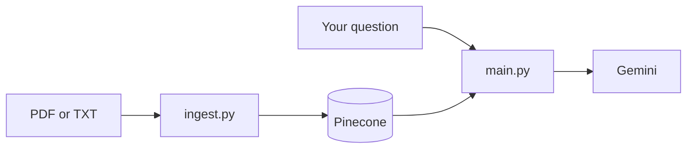

# RAG workshop chatbot (beginner)

Tiny **Retrieval-Augmented Generation** demo: **Gemini** (embeddings + answers) and **Pinecone** (vector search). Good for teaching the basic flow without extra frameworks.

## Architecture (simple)

**Once:** your file → **`python ingest.py`** → text is stored as vectors in **Pinecone** (Gemini builds the vectors).

**Many times:** you type a question → **`python main.py`** → app pulls similar lines from **Pinecone** → **Gemini** writes the answer.



**Ingest in four words:** read → cut into chunks → embed → upload.

**Chat in four words:** embed question → search Pinecone → build prompt → Gemini replies.

| File | Purpose |
|------|---------|
| `config.py` | `DOCUMENT_PATH`, settings, reads `.env` |
| `utils.py` | Open PDF/TXT, split into chunks |
| `ingest.py` | Build the Pinecone index |
| `rag_pipeline.py` | Embed, search, prompt, Gemini |
| `main.py` | Chat loop |

## What you need

- Python **3.10+** recommended  
- A [Google AI Studio](https://aistudio.google.com/apikey) API key (Gemini)  
- A [Pinecone](https://app.pinecone.io/) API key  

## Setup

1. **Clone or copy this folder** to your machine.

2. **Create a virtual environment** (optional but recommended):

   ```bash
   python3 -m venv .venv
   source .venv/bin/activate   # Windows: .venv\Scripts\activate
   ```

3. **Install dependencies**:

   ```bash
   pip install -r requirements.txt
   ```

   This project uses Google’s **`google-genai`** package (`from google import genai`) for Gemini calls.

4. **Configure environment variables**

   Copy the example file and edit it:

   ```bash
   cp .env.example .env
   ```

   Open `.env` and set at least:

   - `GEMINI_API_KEY` — your Gemini key  
   - `PINECONE_API_KEY` — your Pinecone key  
   - `PINECONE_INDEX_NAME` — any name you like (default is fine)  
   - `PINECONE_CLOUD` and `PINECONE_REGION` — usually `aws` and `us-east-1` (must match what Pinecone allows for your account)

## Choose your document

Edit **`DOCUMENT_PATH`** in **`config.py`** (see the examples in that file).  
Whenever you change the file or path, run **`python ingest.py`** again.

## Run

**1 — Build the index**

```bash
python ingest.py
```

**2 — Chat** (you will see `You:` / `Agent:` turns)

```bash
python main.py
```

## Optional `.env` tweaks

| Variable | Meaning |
|----------|--------|
| `GEMINI_CHAT_MODEL` | Model id, e.g. `gemini-1.5-flash` |
| `GEMINI_EMBEDDING_MODEL` | Model id, e.g. `gemini-embedding-001` |
| `EMBEDDING_DIMENSION` | Must match your embedding size (default `768`) |
| `TOP_K` | How many chunks to retrieve (default `4`) |
| `CHUNK_SIZE_CHARS` / `CHUNK_OVERLAP_CHARS` | How text is split before embedding |

